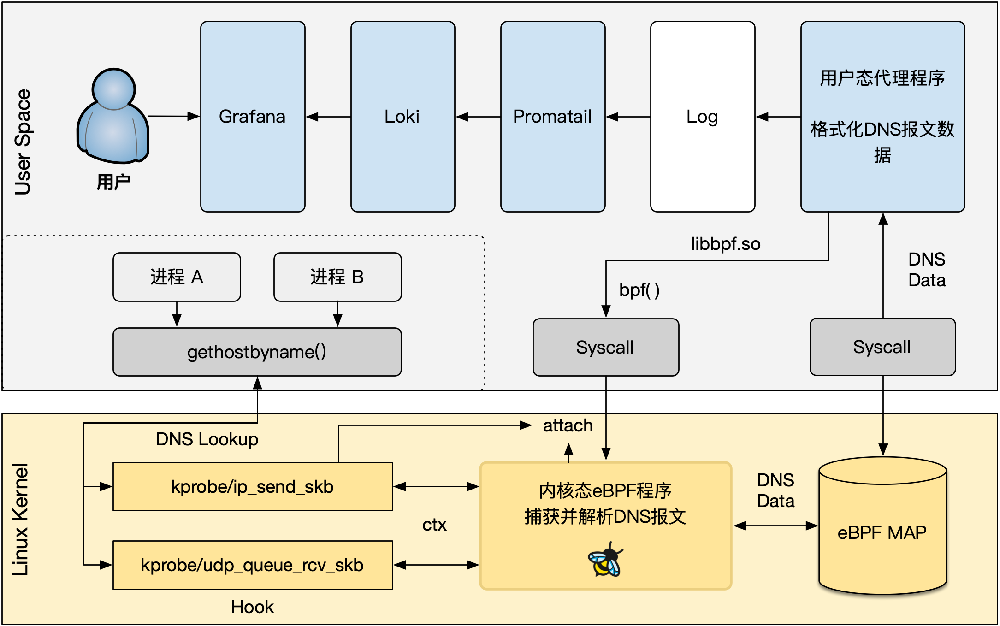

# eBPF demo程序框架

> 基于libbpf

## 系统环境
该模板基于 libbpf.so 库，系统为`ubuntu 22.04 LTS`
内核版本

```bash
$ uname -a
Linux ubuntu-Super-Server 6.8.0-60-generic #63~22.04.1-Ubuntu SMP PREEMPT_DYNAMIC Tue Apr 22 19:00:15 UTC 2 x86_64 x86_64 x86_64 GNU/Linux
```

## 依赖安装

```bash
sudo apt update
sudo apt install libbpf-dev
sudo apt install clang llvm linux-headers-$(uname -r)
```


## 包含的示例

### dnsnoop

使用eBPF对DNS主机DNS报文进行解析分析

### exitsnoop

监测主机上所有的进程退出事件

### vfsnoop

监测Linux IO子系统中VFS层的读写系统调用

### iosnoop

监测Linux IO子系统中块设备层的读写请求

### 

## 项目结构

> 为清晰展示，仅展示一个模块相关的文件

```bash
├── bpf
│   └── dns.bpf.c
├── include
│   ├── dns.bpf.h
│   ├── utils.h
│   └── vmlinux.h
├── Makefile
├── output
│   └── dns
├── README.md
├── skel
│   └── dns.skel.h
└── src
    └── dns.cpp
```

## 开始编写新模块

在`Makefile`文件中增加新的target
```Makefile
TARGETS := dns new_target_name ...
```
假设这里使用`example`作为新的target的名称，根据项目结构，分别以`example`为MainName添加共享头文件`example.bpf.h`、eBPF程序`example.bpf.c`、用户态代理程序`example.cpp`即可，需要注意名称必须保持一致，make过程中会根据这个规则进行检测，详见 Makefile

一个新的模块编写时，项目结构应当如下：
```bash
├── bpf
│   ├── example.bpf.c # 内核态eBPF程序
├── include
│   ├── example.bpf.h # 共享的头文件
│   ├── utils.h
│   └── vmlinux.h
├── Makefile
├── output
│   └── example # 编译出的可执行文件
├── README.md
├── skel
│   ├── example.skel.h # eBPF程序skel文件
└── src
    └── example.cpp # 用户态代理程序
```

## 编译并运行

```bash
make clean && make
sudo output/example
```


## 扩展：可视化分析

用户态代理程序将捕获到的元信息输出为日志，使用`Promtail`+`Loki`进行日志收集和存储，使用`Grafana`进行可视化分析，架构如下：



分析结果展示


